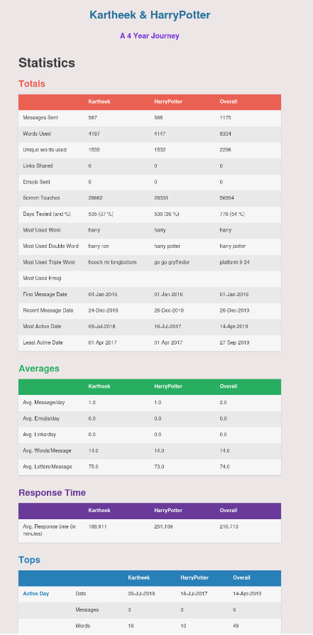
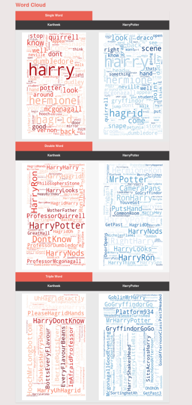

## Overview

Chat Explore analyzes a WhatsApp chat export between two participants and generates:

* Cleaned tabular data for inspection.
* Statistical summaries for each participant and overall conversation.
* Visualizations for language usage, activity trends, sentiment, emoji usage, and response behavior.
* A standalone HTML report with embedded charts and summary tables.

The project is implemented as a Python CLI workflow with modular parsing, preprocessing, analysis, plotting, and report generation components.

## Highlights

* Supports multiple WhatsApp export formats through automatic format detection.
* Handles multi-line messages correctly during parsing.
* Uses a local Hugging Face sentiment model for English, Hinglish, and romanized Telugu-style chat text.
* Computes per-user and overall metrics, including response-time statistics.
* Produces a single shareable HTML report file with embedded plot images.
* Includes automated tests for parser behavior, response-time logic, and core CLI I/O paths.

## Supported Input Formats

The parser currently supports:

* Android 24-hour exports.
* Android 12-hour exports.
* iOS bracketed timestamp exports.

Date parsing supports day-first and month-first interpretations when necessary.

## Current Constraints

* The analysis pipeline requires exactly two unique users in the chat export.
* Group chats are not supported in the current implementation.
* The media-count plot is not implemented.

## Quick Start

### Prerequisites

* Python 3.11 or later.
* UV package manager.
* Internet access on the first sentiment run so Hugging Face can download the local model.

Sentiment analysis runs locally with `cardiffnlp/twitter-xlm-roberta-base-sentiment`.
If available, the model uses CUDA first, then Apple Silicon MPS, and otherwise falls back to CPU.

### Installation

```bash
uv venv .venv
uv sync
```

If you prefer a pip-style setup:

```bash
python -m venv .venv
source .venv/bin/activate
pip install -r requirements.txt
```

## Usage

Run the analysis with a WhatsApp exported text file:

```bash
uv run python run.py -f /path/to/whatsapp_chat.txt
```

Example:

```bash
uv run python run.py -f data/chat-madhu.txt
```

The CLI exits with an error if:

* The input path does not exist.
* The input path is not a file.
* The input file is empty.
* The parsed conversation does not contain exactly two users.

## Outputs

After a successful run, outputs are generated in:

* data/html/: Timestamped report, for example chat_explore_YYYYMMDDHHMMSS.html.
* data/excel/clean_data.xlsx: Cleaned and parsed conversation data.

Temporary artifacts are generated during runtime and then cleaned up:

* plots/: Intermediate plot PNG files.
* logs/: Runtime log files.

## What the Report Includes

The generated HTML report includes:

* Totals: Messages, words, unique words, links, emojis, screen touches, active dates.
* Averages: Per-day and per-message communication metrics.
* Response analysis: Average response time per participant and overall.
* Top patterns: Active days, longest conversation windows, top n-grams.
* Emoji insights: Ranked emoji usage by participant.
* Temporal trends: Monthly messaging, words, emojis, Hugging Face sentiment, and first-text behavior.
* Visual summaries: Word clouds and timeline plots.

## Development

### Run Tests

```bash
uv run pytest -q
```

### Project Layout

* run.py: CLI entry point and orchestration flow.
* src/core/: Parsing, preprocessing, user modeling, response analytics.
* src/analysis/: Sentiment analysis helpers.
* src/plotting/: Plot generation modules.
* src/output/: HTML report generation.
* src/utils/: Logging, helper utilities, cleanup.
* tests/: Parser, response, and CLI-oriented tests.

## Sample Report Screens





## Contributors

* [@kartheekpnsn](https://github.com/kartheekpnsn)
* [@yashkuru](https://github.com/yashkuru)

## Acknowledgement

This project idea was inspired by the Reddit visualization thread:

* [Original post](https://www.reddit.com/r/dataisbeautiful/comments/aiahpx/another_1_year_whatsapp_chat_visualization_oc/)
* [Author citation](https://www.reddit.com/r/dataisbeautiful/comments/aiahpx/another_1_year_whatsapp_chat_visualization_oc/eem8gke/)
